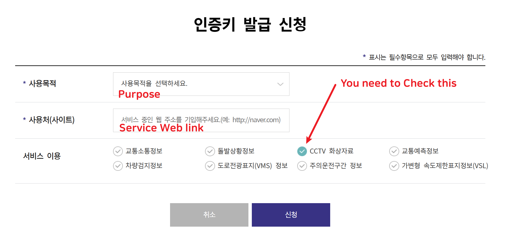
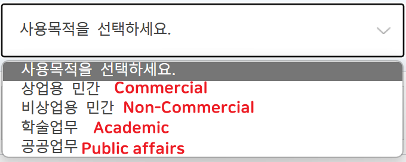

# Show Me The Highway

A mini project using OpenCV for real-time analysis of highway traffic conditions with data provided by the National Transport Information Center.

## Main Goal

- Retrieve CCTV data from the National Transport Information Center using their [API](https://www.its.go.kr/opendata/).
- Analyze vehicle density in CCTV videos using OpenCV.
- Transmit analyzed information to a mobile app for visualizing both the video stream and detected vehicle density.

## Libraries needed
- python-OpenCV
- requests
- numpy
- asciimatics

## How to Use

To use the program:

1. Obtain an API key by following the [API application process](https://www.its.go.kr/user/issueAuthKey?service=OPD_00000003).
2. Create an "apiKey.txt" file in the `datafiles` folder.
3. Paste the API key into the "apiKey.txt" file.

During testing, you can use 'test' as a placeholder for the API key.

How to Apply for API?

Obtain the API key by specifying the purpose, usage, and desired services.

**Purpose Options:**

## Project Overview

***Our goal*** is to provide a user-friendly program that enhances the convenience of accessing real-time highway traffic information. Utilizing the Korea Expressway Corporation's free API, we employ OpenCV to analyze images from CCTV cameras along highways. 
The program responds with user-friendly messages such as "Highway congestion detected" or "Traffic is smooth, proceed at a moderate speed."

## Project Progress
The process of the program 
---

1. First get real-time traffic information and highway conditions images through open api
2. Secondly, the information received through the code is analyzed using opencv.
3. Third, according to the analysis, the concentration of vehicles in the place is checked and the degree of traffic congestion is notified through the output of the phrase
4. Increase the convenience of using the highway.

---

## Contributing

Feel free to contribute to the project or use the code for your applications!
